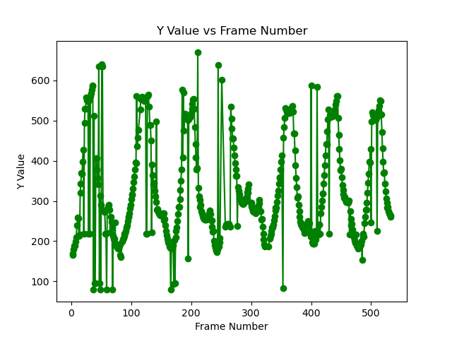

# TrackNet: Tennis Ball Tracking from Broadcast Video by Deep Learning Networks
Refer the site below for more information
https://nol.cs.nctu.edu.tw:234/open-source/TrackNet/tree/master

## First, you have to install cuda, cudnn and tensorflow, tutorial:
https://medium.com/@zhanwenchen/install-cuda-and-cudnn-for-tensorflow-gpu-on-ubuntu-79306e4ac04e

## Second, install some python library with pip:
* sudo pip install numpy
* sudo pip install matplotlib
* sudo pip install pillow
* sudo pip install keras 
* sudo pip install opencv-python 
* sudo pip install pydot
* sudo pip install h5py
* sudo apt-get install graphviz

## The sample of the position of the ball (finaltestvideo.mp4)

<!-- ## How to train a new TrackNet I weight?
1. Create heatmap as Ground Truth, and save heatmap as JPG file
	Code be save in TrackNet_Python.ipynb (first part), you may need to change the folder path in python code
2. The training file name and testing file name of TrackNet must be output as csv file
	Code be save in TrackNet_Python.ipynb (second part), you also need to change the folder path in code
3. Copy the training_model1.csv file and testing_model1.csv file to TrackNet_One_Frames_Input folder
4. After have training images and ground truth, we can start to train the TrackNet model I
	* Open command line
	* Change directory to TrackNet_One_Frames_Input folder 
	* Using following command as example, you may need to change the command:
	
	    > python train.py --save_weights_path=weights/model --training_images_name="training_model1.csv" --epochs=500 --n_classes=256 --input_height=360 --input_width=640 --load_weights=1 --step_per_epochs=200 --batch_size=2
	* Trained model weight will be save in weights/model.0

	* Detailed explanation
			--save_weights_path: Save the weight path
			--training_images_name: Training images csv file path, training_model1.csv
			--epochs: Epochs be set as 500 in this work
			--n_classes: Last layer classes, since the output value of TrackNet is between 0-255, the last layer depth be set as 256 
			--input_height: Input height be resize as 360 in this work
			--input_width: Input width be resize as 640 in this work
			--load_weights: If you want to retrain the weights from previous weight, give the number of weight in weights/model. If not, delete it.
			--step_per_epochs: Step per Epochs be set as 200 in this work
			-batch_size: Batch size be set as 2 in this work
    

## How to train a new TrackNet II weight?
1. Create heatmap as Ground Truth, and save heatmap as JPG file
	Code be saved in TrackNet_Python.ipynb (first part), you may need to change the folder path in python code
2. The training file name and testing file name of TrackNet must be output as csv file
	Code be save in TrackNet_Python.ipynb (third part), you also need to change the folder path in code
3. Copy the training_model2.csv file and testing_model2.csv file to TrackNet_Three_Frames_Input folder
4. After have training images and ground truth, we can start to train the TrackNet model II
	* Open command line
	* Change directory to TrackNet_Three_Frames_Input folder 
	* Using following command as example, you may need to change the command:
	
		> python train.py --save_weights_path=weights/model --training_images_name="training_model2.csv" --epochs=500 --n_classes=256 --input_height=360 --input_width=640 --load_weights=2 --step_per_epochs=200 --batch_size=2
    * Trained model weight will be save in weights/model.0
    
	* Detailed explanation
			--save_weights_path: Save the weight path
			--training_images_name: Training images csv file path, training_model2.csv
			--epochs: Epochs be set as 500 in this work
			--n_classes: Last layer classes, since the output value of TrackNet is between 0-255, the last layer depth be set as 256 
			--input_height: Input height be resize as 360 in this work
			--input_width: Input width be resize as 640 in this work
			--load_weights: If you want to retrain the weights from previous weight, give the number of weight in weights/model. If not, delete it.
			--step_per_epochs: Step per Epochs be set as 200 in this work
			-batch_size: Batch size be set as 2 in this work

## How to train a new TrackNet II' weight?
1. Create heatmap as Ground Truth, and save heatmap as JPG file
	Code be save in TrackNet_Python.ipynb (first part), you may need to change the folder path in python code
2. The training file name and testing file name of TrackNet must be output as csv file
	Code be save in TrackNet_Python.ipynb (third part, fourth part and fifth part), you also need to change the folder path in code
3. Copy the training_model3.csv file to TrackNet_Three_Frames_Input folder
4. After have training images and ground truth, we can start to train the TrackNet model II'
	* Open command line
	* Change directory to TrackNet_Three_Frames_Input folder 
	* Using following command as example, you may need to change the command:
	
		> python train.py --save_weights_path=weights/model --training_images_name="training_model3.csv" --epochs=500 --n_classes=256 --input_height=360 --input_width=640 --load_weights=2 --step_per_epochs=200 --batch_size=2
	* Trained model weight will be save in weights/model.0
	
	* Detailed explanation
			--save_weights_path: Save the weight path
			--training_images_name: Training images csv file path, training_model3.csv
			--epochs: Epochs be set as 500 in this work
			--n_classes: Last layer classes, since the output value of TrackNet is between 0-255, the last layer depth be set as 256 
			--input_height: Input height be resize as 360 in this work
			--input_width: Input width be resize as 640 in this work
			--load_weights: If you want to retrain the weights from previous weight, give the number of weight in weights/model. If not, delete it.
			--step_per_epochs: Step per Epochs be set as 200 in this work
			-batch_size: Batch size be set as 2 in this work

## How to output all of heatmap predictions?
1. Open command line
2. Change directory to TrackNet folder (TrackNet_Three_Frames_Input or TrackNet_One_Frames_Input)
3. Using following command as example, you may need to change the command:
	
		python  predict.py  --save_weights_path=weights/model.2 --test_images="/media/andersen/D/Thesis/Dataset/Clip"  --output_path="/media/andersen/D/Thesis/Prediction/Model2/Clip" --n_classes=256 --input_height=360 --input_width=640 --output_height=720 --output_width=1280 

	* Detailed explanation
			--save_weights_path: which model weight need to be loaded
			--test_images: testing images path
			--output_path: output heatmap path
			--n_classes: in this work depth be set as 256 
			--input_height: Input height be resize as 360 in this work
			--input_width: Input width be resize as 360 in this work
			--output_height: resize the heatmap height, output height be set as 720 in this work
			-output_width: resize the heatmap width,output width be set as 1280 in this work -->

## How to use TrackNet predict video?
1. Open command line
2. Change directory to TrackNet folder (TrackNet_Three_Frames_Input or TrackNet_One_Frames_Input)
3. using following command as example, you may need to change the command:
	
		python  predict_video.py  --save_weights_path=weights/model.3 --input_video_path="/media/andersen/D/Test/Clip1.mp4" --output_video_path="/media/andersen/D/Test/Clip1_TrackNet.mp4" --n_classes=256 

	* Detailed explanation
			--save_weights_path: which model weight need to be loaded
			--input_video_path: Input video path
			--output_video_path: Output video path, if not, the video will be save in the same path of input video
			--n_classes: In this work depth be set as 256 

## TrackNet trained weights:
	* TrackNet model I   >>   TrackNet_One_Frames_Input/weights.model.1
	* TrackNet model II  >>   TrackNet_Three_Frames_Input/weights.model.2
	* TrackNet model II' >>   TrackNet_Three_Frames_Input/weights.model.3

## Dataset
A dataset is available via the link:
https://nycu1-my.sharepoint.com/:u:/g/personal/tik_m365_nycu_edu_tw/ETCr6-M0e1VDhGCdMbvljcsBu31AJTO5xa_1cW8pHa7niA?e=55tLJ9

## Labeling Tool: Make your own dataset
See the readme file in the LabelingTool directory

## Reference:
If you use TrackNet in your work, please cite the following papers!
1. Yu-Chuan Huang, "TrackNet: Tennis Ball Tracking from Broadcast Video by Deep Learning Networks," 
    Master Thesis, advised by Tsì-Uí İk and Guan-Hua Huang, National Chiao Tung University, Taiwan, April 2018.
2. Yu-Chuan Huang, I-No Liao, Ching-Hsuan Chen, Tsì-Uí İk, and Wen-Chih Peng, 
    "TrackNet: A Deep Learning Network for Tracking High-speed and Tiny Objects in Sports Applications,"
    in the IEEE International Workshop of Content-Aware Video Analysis (CAVA 2019)
    in conjunction with the 16th IEEE International Conference on Advanced Video and Signal-based Surveillance (AVSS 2019),
    18-21 September 2019, Taipei, Taiwan.

